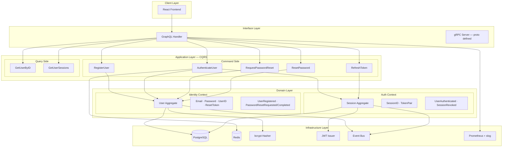

# Authentication Module — Engineer Challenge Solution

Production-grade authentication service built with **Go**, **PostgreSQL**, **Redis**, and **GraphQL**, following **DDD** and **CQRS** patterns.

## Quick Start

```bash
# Clone and run with Docker Compose
git clone https://github.com/telman03/engineer-challenge.git
cd engineer-challenge
cp .env.example .env
docker compose up --build
```

Services:
| Service | URL |
|---------|-----|
| Auth API (GraphQL) | http://localhost:8080/graphql |
| Health Check | http://localhost:8080/health |
| Prometheus Metrics | http://localhost:8080/metrics |
| Prometheus UI | http://localhost:9090 |
| Grafana | http://localhost:3001 |

### Run Frontend

```bash
cd web
npm install
npm run dev
# Open http://localhost:3000
```

### Run Tests

```bash
go test ./internal/... -v
```

## Architecture



## Technology Stack & Rationale

| Technology | Choice | Alternatives Considered | Why |
|-----------|--------|------------------------|-----|
| Language | **Go 1.25** | Rust, TypeScript | Strong concurrency, fast compilation, excellent stdlib for HTTP/crypto, minimal runtime overhead |
| Database | **PostgreSQL 16** | MySQL, MongoDB | ACID compliance, robust JSON support, mature ecosystem for auth data |
| Cache/Rate Limit | **Redis 7** | In-memory map, memcached | Atomic operations for sliding window rate limiting, distributed support |
| API | **GraphQL** | REST, gRPC | Type-safe schema, single endpoint, ideal for frontend flexibility; gRPC proto defined for service-to-service |
| Password Hashing | **bcrypt (cost=12)** | argon2id, scrypt | Well-understood, constant-time comparison, widely audited |
| Tokens | **JWT HMAC-SHA256** | Opaque tokens, Paseto | Stateless verification, standard claims, broad library support |
| Frontend | **React + TypeScript + Vite** | Next.js, Vue | Lightweight SPA, fast HMR, type safety |

## Where to Find DDD, CQRS, and IaC

### DDD — Domain-Driven Design

- **Bounded Contexts**: Two explicit contexts — `Identity` (user lifecycle: registration, password management) and `Auth` (session management: login, token rotation)
- **Aggregates**: `User` aggregate root (`internal/domain/identity/aggregate/user.go`) and `Session` aggregate root (`internal/domain/auth/aggregate/session.go`)
- **Value Objects**: `Email`, `Password`, `UserID`, `ResetToken`, `SessionID`, `TokenPair` — immutable, self-validating types
- **Domain Events**: `UserRegistered`, `PasswordResetRequested`, `PasswordResetCompleted`, `UserAuthenticated`, `SessionRevoked`
- **Repository Interfaces**: Port interfaces in domain layer, adapter implementations in infrastructure

### CQRS — Command Query Responsibility Segregation

- **Command Handlers** (`internal/application/command/`):
  - `RegisterUserHandler` — creates user with hashed password
  - `AuthenticateUserHandler` — validates credentials, creates session, enforces max 5 sessions
  - `RefreshTokenHandler` — rotates refresh token, extends session
  - `RequestPasswordResetHandler` — generates reset token (anti-enumeration: always returns success)
  - `ResetPasswordHandler` — validates token, updates password
- **Query Handlers** (`internal/application/query/`):
  - `GetUserByIDHandler` — returns user DTO
  - `GetUserSessionsHandler` — returns active sessions

### IaC — Infrastructure as Code

- **Docker Compose** (`docker-compose.yml`) — Full local stack: auth-server, PostgreSQL, Redis, DB migrations, Prometheus, Grafana
- **Terraform** (`deployments/terraform/`) — AWS deployment: VPC, RDS PostgreSQL, ElastiCache Redis, ECS Fargate, ALB, ECR, SSM for secrets
- **Kubernetes** (`deployments/k8s/`) — Deployment (2 replicas), Service, ConfigMap, liveness/readiness probes

## Key Business Rules & Invariants

| Rule | Implementation |
|------|---------------|
| Password complexity | Min 8 chars, uppercase, lowercase, digit, special char (`Password` value object) |
| Email normalization | Lowercase, trimmed, RFC 5322 validated (`Email` value object) |
| Max concurrent sessions | 5 per user — oldest revoked on new login (`AuthenticateUser` handler) |
| Reset token lifecycle | 15-minute TTL, single-use, cryptographically random 32 bytes |
| Anti-enumeration | Password reset always returns success regardless of email existence |
| Token expiration | Access: 15 min, Refresh: 7 days |
| Rate limiting | Redis sliding window — prevents brute force on login |
| Replay protection | Refresh token rotation — old token invalidated on use |

## Trade-offs

| Decision | Trade-off |
|----------|-----------|
| Synchronous event bus | Simpler implementation, but domain events are coupled to request lifecycle. Production would use NATS/Kafka |
| JWT over opaque tokens | Stateless verification is fast, but tokens cannot be individually revoked without a blocklist |
| Single database | Shared read/write store. CQRS is logical, not physical — sufficient for auth scale |
| bcrypt over argon2id | Wider library support and auditing history, but argon2id offers better GPU resistance |
| GraphQL over REST | Strongly typed schema reduces client bugs, but adds complexity for simple CRUD |
| In-memory event bus | No external dependency for MVP, but events are lost on crash |

## Production Next Steps

1. **Message Broker** — Replace in-memory event bus with NATS or Kafka for reliable event delivery
2. **Token Blocklist** — Redis-backed JWT blocklist for immediate token revocation
3. **Email Service** — Actually send password reset emails via SES/SendGrid
4. **MFA** — TOTP (RFC 6238) as second factor
5. **Audit Log** — Persistent security event log for compliance
6. **gRPC Server** — Implement the defined proto for service-to-service communication
7. **OpenTelemetry** — Distributed tracing for production observability
8. **CI/CD Pipeline** — GitHub Actions with linting, testing, security scanning, and deployment
9. **Connection Pooling** — pgbouncer for database connection management at scale
10. **Secrets Management** — Vault or AWS Secrets Manager instead of env vars

## Project Structure

```
├── cmd/server/main.go          # Server entry point
├── internal/
│   ├── domain/
│   │   ├── identity/           # Identity Bounded Context
│   │   │   ├── aggregate/      # User aggregate root
│   │   │   ├── valueobject/    # Email, Password, UserID, ResetToken
│   │   │   ├── event/          # Domain events
│   │   │   └── repository/     # Port interface
│   │   └── auth/               # Auth Bounded Context
│   │       ├── aggregate/      # Session aggregate root
│   │       ├── valueobject/    # SessionID, TokenPair
│   │       ├── event/          # Domain events
│   │       └── repository/     # Port interface
│   ├── application/
│   │   ├── command/            # Write operations (CQRS commands)
│   │   └── query/              # Read operations (CQRS queries)
│   ├── infrastructure/
│   │   ├── crypto/             # bcrypt + JWT implementations
│   │   ├── eventbus/           # In-memory event bus
│   │   ├── observability/      # Prometheus metrics + structured logging
│   │   └── persistence/        # PostgreSQL + Redis adapters
│   └── interfaces/
│       └── graphql/            # GraphQL schema, resolver, handler
├── web/src/                    # React frontend
├── migrations/                 # SQL migrations
├── proto/                      # gRPC proto definition
├── deployments/
│   ├── terraform/              # AWS infrastructure
│   ├── k8s/                    # Kubernetes manifests
│   ├── prometheus/             # Monitoring config
│   └── grafana/                # Dashboard config
├── docs/                       # Architecture docs + ADRs
├── .agents/                    # AI usage documentation
├── Dockerfile                  # Multi-stage build
└── docker-compose.yml          # Local development stack
```

## Documentation

- [Full Workspace Guide](docs/FULL_WORKSPACE_GUIDE.md) — Single detailed guide with easy explanations of all folders and flows
- [Architecture Documentation](docs/README.md) — Detailed system design
- [API Reference](docs/API.md) — GraphQL operations and examples
- [ADRs](docs/adr/) — Architecture Decision Records

---

> See the original challenge description below.

---


## Бонусные сигналы

- Event-driven взаимодействие между компонентами.
- Service mesh / policy-driven networking (если уместно и обосновано).
- Продуманная стратегия эволюции схемы данных и backward compatibility.
- ADR (Architecture Decision Records) для ключевых решений.

## Важно

Нас интересует не «идеальный продакшен за вечер», а качество инженерного мышления и способность строить систему осознанно.
